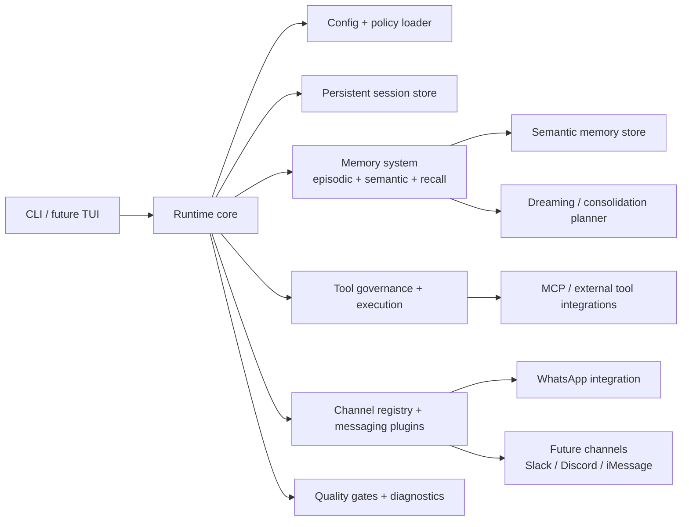
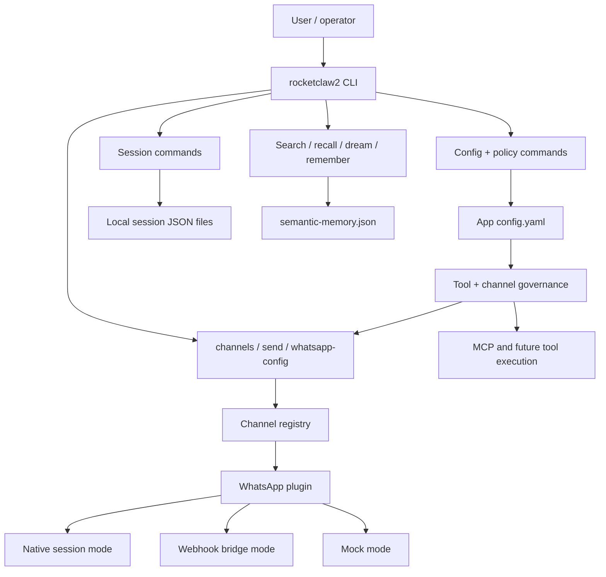
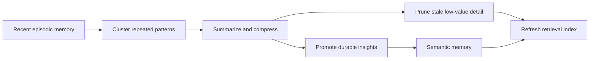
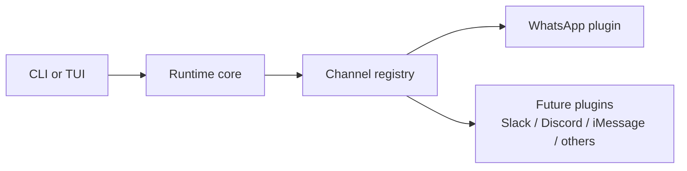
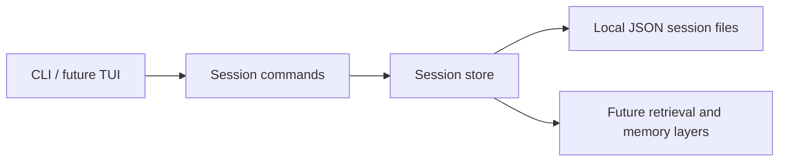

# RocketClaw2

RocketClaw2 is a Node.js and TypeScript reimplementation of RocketClaw, designed as a modern modular personal AI runtime.

## Status
Core runtime, native WhatsApp transport, autonomous harness flows, and the v0.2.0 built-in skills documentation set are in place. Current work is focused on tightening operator guidance, demos, and the next layer of guided autonomy workflows.

## Goals
- reimplement RocketClaw in Node.js with TypeScript
- use modern, production-friendly libraries
- ship strong docs, diagrams, demos, and screenshots
- keep the runtime modular and testable

## Planned stack
- Node.js 22+
- TypeScript
- Commander or CAC for CLI
- Zod for config validation
- Undici for HTTP
- Pino for logging
- Vitest for tests

## Component architecture


## Integration points


## Documentation map
- `AGENTS.md` - project working rules
- `TASKS.md` - active backlog and milestones
- `STATE.md` - current status and decisions
- `docs/ARCHITECTURE.md` - technical design
- `docs/SETUP.md` - setup instructions
- `docs/USAGE.md` - CLI usage
- `docs/DEMOS.md` - demo scenarios
- `docs/skills-roadmap/` - built-in skill roadmap, setup guidance, and demos for agentic patterns
  - includes Ralph Loop, Karpathian Loop, Second Brain, Evaluator-Optimizer, Multi-Agent Teams, and World Model roadmap docs
  - `BUILT-IN-SKILLS.md` now serves as the maturity snapshot/index for which patterns are documented, demoed, or still only partially implemented

## Next steps
- expand the v0.2.0 roadmap around built-in guided skills for agentic autonomy patterns
- add setup, usage, and demo docs for Ralph Loop, Karpathian Loop, World Model, Second Brain, Multi-Agent Teams, and Evaluator-Optimizer workflows
- prototype built-in skill packs and operator-friendly onboarding flows
- keep improving autonomous execution and verification ergonomics

## Bootstrap commands
```bash
npm install
npm run build
npm run verify:build
npm test
node dist/src/cli.js doctor
node dist/src/cli.js run --profile default
```

`npm run build` now also sets executable permissions on `dist/src/cli.js`, so `npm link` produces a runnable `rocketclaw2` command without a manual chmod step.

## Current implementation
- TypeScript CLI/runtime with config, governance, diagnostics, and packaging verification
- persistent sessions plus episodic/semantic memory, recall, dreaming, and promotion flows
- interactive chat shell with LLM support, recall-aware responses, and persistent session history
- governed tool and messaging execution with approvals, next-step guidance, and yolo posture controls
- autonomous coding harness flows (`auto-code`, `harness-plan`, `harness-run`, resume/inspect/validate tooling)
- native WhatsApp transport with QR/bootstrap flows, inbound session bridging, self-chat-only safety, and outbox inspection
- roadmap/docs/demo coverage for Ralph Loop, Karpathian Loop, World Model, Second Brain, Multi-Agent Teams, and Evaluator-Optimizer patterns
- persisted world-model handoff artifacts for planning, delegation, and later review
- `team-role-template` for first-class scoped PM / architect / implementer / reviewer briefs

## Validation
- `npm run build` ✅
- `npm run verify:build` ✅
- `npm test` ✅

Packaging also re-runs build verification automatically via `prepack`, so `npm pack` or publish-style flows cannot skip the canonical CLI entrypoint check.

A GitHub Actions CI workflow now runs `npm ci`, `npm run lint`, `npm run build`, `npm run verify:build`, `npm test`, and `npm run verify:pack` on every push and pull request.

CI also creates the `.tgz` package with `npm pack --ignore-scripts` and uploads it as a workflow artifact, so release candidates can be inspected directly from the run.

The package manifest now also limits published files to runtime build output under `dist/src/**` plus docs, so raw source, test trees, and compiled test artifacts do not leak into the npm tarball.

The production build now compiles from `tsconfig.build.json`, while repo-wide typechecking still uses the main `tsconfig.json`. That keeps runtime output lean without losing test coverage in `lint`.

A `prepublishOnly` guard now re-runs build and pack verification before any real publish flow.

A separate tag-triggered GitHub Actions release workflow now repeats the full quality gate on `v*` tags, uploads the verified tarball, and only runs `npm publish` when `NPM_TOKEN` is configured in repository secrets.


## Memory roadmap

RocketClaw2 will use a tiered memory design with a dreaming-inspired optimization loop.

### Persistent memory tiers
- **Working memory** for active tasks and short-lived context
- **Episodic memory** for recent logs, sessions, and event trails
- **Semantic memory** for curated durable facts, preferences, decisions, and distilled insights

### Dreaming-inspired memory optimization


### Planned strategy
- keep raw recent memory separate from curated long-term memory
- run background consolidation on a schedule
- promote only durable and retrieval-worthy information
- compress or prune stale low-salience details
- maintain salience scores and retrieval indexes over time


## Messaging plugin architecture

RocketClaw2 is being designed with a plugin-based messaging interface so channels can be added without rewiring the core runtime.



### Current channel plan
- **WhatsApp** is the first implemented channel plugin.
- Future channels may include **iMessage**, **Slack**, and **Discord** if there is real user demand.
- The runtime will talk to a stable plugin contract instead of hardcoding channel-specific logic.


## Smart CLI and terminal UI roadmap
- smart CLI commands for setup, diagnosis, messaging, and memory workflows
- interactive TUI for sessions, memory inspection, and channel operations
- plugin-aware message composer and send flows
- setup wizard and diagnostics for local or hosted environments
- operator-friendly terminal UX with clear progress and recovery messaging
- guided built-in skill onboarding for popular agentic patterns and autonomy workflows


## Session model

RocketClaw2 now includes a persistent file-backed session layer.



### Current session commands
- `rocketclaw2 session-create --title "My Session"`
- `rocketclaw2 session-list`
- `rocketclaw2 session-show --id <session-id>`
- `rocketclaw2 session-append --id <session-id> --role user --text "hello"`


## Interactive runtime shell

RocketClaw2 now includes a simple interactive chat shell on top of persistent sessions.

### Current command
- `rocketclaw2 chat --title "My Session"`
- `rocketclaw2 chat --session-id <existing-session-id>`

This is intentionally minimal right now and acts as the base layer for the future smart terminal UI.


## Retrieval and recall layer

RocketClaw2 now includes retrieval over persisted sessions and unified recall across both sessions and curated semantic memory.

### Current commands
- `rocketclaw2 search --query "alpha"`
- `rocketclaw2 recall --query "alpha"`
- `rocketclaw2 recall --query "alpha" --kind semantic`
- `rocketclaw2 recall --query "alpha" --summary`

`search` focuses on persisted session messages. `recall` searches both episodic session memory and curated semantic memory together.


## Dreaming progress

RocketClaw2 now includes a first-pass salience scorer and consolidation planner.

### Current command
- `rocketclaw2 dream`

This does not rewrite memory yet, but it identifies candidate session messages for promotion or summarization as the first executable step toward a dreaming loop.


## Curated semantic memory

RocketClaw2 now has a first semantic memory store for promoted durable insights.

### Current commands
- `rocketclaw2 memory-list`
- `rocketclaw2 memory-list --tag preference`
- `rocketclaw2 memory-list --min-salience 40 --summary`
- `rocketclaw2 remember`

The current `remember` flow promotes the strongest available consolidation candidate into curated semantic memory. This is the first real write path for the dreaming-inspired memory system.


## Memory-aware chat behavior

The interactive chat shell now consults unified recall before generating a reply.

### Current behavior
- if relevant semantic or session memory exists, the assistant reply includes a small memory context section
- if nothing relevant is recalled, the shell falls back to a minimal echo response

This is still intentionally simple, but it closes the loop between memory storage and runtime usage.


## Smart operator CLI

RocketClaw2 now includes more human-readable operator views for sessions and semantic memory.

### Current examples
- `rocketclaw2 session-list`
- `rocketclaw2 session-list --title-contains "demo"`
- `rocketclaw2 session-show --id <session-id>`
- `rocketclaw2 session-show --id <session-id> --summary`
- `rocketclaw2 session-show --id <session-id> --limit 5`
- `rocketclaw2 session-stats`
- `rocketclaw2 memory-list`
- `rocketclaw2 memory-list --tag preference`
- `rocketclaw2 memory-list --min-salience 40 --summary`
- add `--json` when raw structured output is preferred

This is the first step toward a richer terminal operator experience before a full TUI is introduced.


The operator CLI now supports lightweight filtering, compact overview mode, adjustable transcript length, and aggregate stats so you can inspect runtime state faster from a terminal.


## Configurable tool access model

RocketClaw2 is being designed so users can configure tool access instead of hardcoding a single policy forever.

### Core tool categories
- File Management System
- Database Connectors
- API Connector & Workflow Automation
- MCP Servers
- Email Client
- Calendar & Scheduling Manager
- Data Extraction / Web Scraper
- Human-in-the-Loop Approval

### Access levels
- `disabled`
- `read-only`
- `guarded-write`
- `full-access`

### Safety model
- tools start from **safe default access policies**
- RocketClaw2 should explain:
  - tool purpose
  - risk level
  - recommended access
  - stricter default access where appropriate
- users should be able to **override** the default posture after reviewing risks and recommendations
- high-stakes write actions should remain gated behind **human approval** unless the user intentionally changes policy

### Current commands
- `rocketclaw2 tools`
- `rocketclaw2 tool-risk`
- `rocketclaw2 tool-policy`
- `rocketclaw2 tool-policy --access guarded-write`
- `rocketclaw2 tool-policy --overridden`
- `rocketclaw2 tool-policy-summary`
- `rocketclaw2 tool-set --tool file-management --access guarded-write --reason "report generation" --ack-risk`


## Future design concepts

RocketClaw2 roadmap now explicitly includes:
- psychology-grounded memory design with episodic and semantic layers
- memory decay and salience adjustment over time
- vector-based contextual retrieval in a future phase
- context reset and handoff artifacts for long-running work
- parent/child task orchestration with isolated sub-agent briefs
- closed-loop validation with quality gates and self-reflection
- terminal-first plus message-based operation models
- built-in skill packs that help operators configure and use proven agentic patterns

### Planned built-in skill packs
- **Ralph Loop**: autonomous verify-and-fix loops for build/test/lint style workflows
- **Karpathian Loop**: iterative improvement loops driven by metrics, evaluation, and learning from prior runs
- **World Model**: structured context modeling so the runtime can reason about user, environment, constraints, and likely next actions
- **Second Brain**: personal knowledge ingestion, retrieval, summarization, and memory curation workflows
- **Multi-Agent Teams**: orchestrated specialist roles with scoped briefs, `team-role-template`, handoffs, and review steps
- **World Model**: explicit tracking of goals, environment state, constraints, blockers, and next actions
- **Evaluator-Optimizer**: generator/critic workflows where one agent produces work and another scores or refines it

These built-in skills are intended to ship with setup guidance, operator commands, and end-to-end demos so new users can adopt advanced patterns without custom prompt engineering first.


Tool access is now configurable in RocketClaw2 config, with explicit risk acknowledgement required before enabling riskier write-capable access levels.


## WhatsApp integration

RocketClaw2 now includes explicit WhatsApp integration configuration as the first concrete message channel path.

### Current capabilities
- WhatsApp channel plugin registration
- mock mode for local development
- webhook mode for external delivery bridges
- configurable default recipient

### Current commands
- `rocketclaw2 messaging-summary`
- `rocketclaw2 whatsapp-config`
- `rocketclaw2 whatsapp-config --mode webhook --webhook-url "https://example.com/hook" --default-recipient "+15551234567"`
- `rocketclaw2 send --channel whatsapp --to "+15551234567" --text "hello"`

### Design direction
- WhatsApp is the first real channel integration
- future channels such as iMessage, Slack, and Discord should reuse the same plugin contract
- user demand should determine which additional channels get implemented next


## Governed execution

RocketClaw2 now begins enforcing configured governance at runtime instead of treating policy as metadata only.

### Current behavior
- WhatsApp sends respect whether WhatsApp integration is enabled
- runtime tool access can be blocked based on configured tool policy
- risky write-capable tools can be gated behind stricter policy and explicit override posture

This is still early-stage enforcement, but it is the first direct connection between configuration and runtime behavior.


Governance inspection is now easier from the terminal: operators can filter policy views and inspect an aggregate access summary without reading raw JSON.


## Config inspection

RocketClaw2 now includes a CLI command to inspect the fully resolved persisted configuration.

### Current command
- `rocketclaw2 config-show`

This helps operators verify the active runtime profile, recall settings, messaging configuration, and tool governance state from the terminal.


## Governed tool execution

RocketClaw2 now includes an operator-visible governed tool execution path.

### Current command
- `rocketclaw2 tool-run --tool file-management --action read`
- `rocketclaw2 tool-run --tool file-management --action write --approve`

This currently simulates execution, but it already enforces configured policy and approval requirements before allowing the action.


Recall inspection now supports filtered and summarized operator views in addition to raw JSON.


## Yolo mode

RocketClaw2 now supports an explicit **yolo mode** that auto-approves actions which would normally require approval.

### Current command
- `rocketclaw2 yolo-config`
- `rocketclaw2 yolo-config --enabled true --warn true`

### Safety notes
- yolo mode is intentionally risky
- RocketClaw2 logs warnings when yolo mode is enabled or used to bypass approval
- this mode should only be enabled by a user who understands and accepts the risks


## Unified system summary

RocketClaw2 now includes a single operator command for inspecting the overall runtime posture.

### Current command
- `rocketclaw2 system-summary`
- `rocketclaw2 system-summary --json`

This command pulls together profile, yolo mode, messaging posture, tool access summary, override counts, and recall scoring into one place.


### Messaging send ergonomics

RocketClaw2 now supports a default WhatsApp recipient fallback and more readable send output.

Examples:
- `rocketclaw2 send --channel whatsapp --text "hello"`
- `rocketclaw2 send --channel whatsapp --to "+15551234567" --text "hello"`
- `rocketclaw2 send --channel whatsapp --text "hello" --json`

If a default WhatsApp recipient is configured, the operator no longer has to repeat `--to` every time.


Semantic memory inspection now supports filtering by tag, filtering by salience threshold, and aggregate summary output.


## Governed messaging execution

RocketClaw2 now includes a governed messaging execution path in addition to the simpler send utility flow.

### Current command
- `rocketclaw2 message-run --channel whatsapp --text "hello" --approve`

This path models approval-aware messaging behavior explicitly and respects yolo mode when enabled.


## Ralph loop

RocketClaw2 now includes a Ralph loop command for repeating work until a success condition is met.

### Current command
- `rocketclaw2 ralph-loop --preset validate --max-iterations 5`
- `rocketclaw2 ralph-loop --preset build --max-iterations 5`
- `rocketclaw2 ralph-loop --command "printf DONE" --until stdout-includes --match-text "DONE" --max-iterations 2`

### Intended use
- keep working until validation passes
- keep retrying a task until output indicates success
- support user-provided stop conditions for iterative development loops


Ralph loop now includes validation-oriented presets and a readable summary view, which makes it more useful for day-to-day development loops.


## Approval workflow

RocketClaw2 now includes a persistent approval request workflow.

### Current commands
- `rocketclaw2 approval-create --kind message-send --target whatsapp --detail "Send daily report"`
- `rocketclaw2 approval-list`
- `rocketclaw2 approval-list --status pending`
- `rocketclaw2 approval-list --status pending --kind message-send`
- `rocketclaw2 approval-list --summary`
- `rocketclaw2 approval-resolve --id <approval-id> --status approved`

This creates the foundation for richer human-in-the-loop workflows across tool execution and messaging.


Approval requests can now be created automatically by governed tool or messaging execution when an action needs approval and none was supplied.


Approval inspection now supports filtering by kind and aggregate summaries for faster human-in-the-loop review.


### Approval execution helper

RocketClaw2 now includes a helper command for approving a request and immediately showing the recommended next execution step.

- `rocketclaw2 approval-approve-run --id <approval-id>`


Approval queue views now include next-step hints so operators can see what to do next without leaving the list view.

- `rocketclaw2 approval-pending`

The pending approval view is optimized for actionability and shows only items that still need operator attention.


## Setup wizard

RocketClaw2 now includes a guided setup helper.

- `rocketclaw2 setup-wizard`


## Readiness diagnostics

RocketClaw2 now includes a richer doctor command for runtime readiness checks.

- `rocketclaw2 doctor`
- `rocketclaw2 doctor --json`

`doctor` is now runtime-aware, warning when WhatsApp session mode lacks a saved session bootstrap or when the workspace still has no session/message activity.


## Recommended next actions

RocketClaw2 now includes an operator guidance command that recommends what to do next based on current runtime posture.

- `rocketclaw2 next-actions`
- `rocketclaw2 next-actions --json`

`next-actions` is now more runtime-aware, surfacing gaps like missing WhatsApp session bootstrap in session mode or the absence of any sessions to exercise the runtime.


## Workspace status

RocketClaw2 now includes a compact dashboard-like command for overall runtime state.

- `rocketclaw2 workspace-status`
- `rocketclaw2 workspace-status --json`

`workspace-status` now acts more like a real operator dashboard by including WhatsApp mode/default recipient/session state and session/message activity, not just coarse counts.


## Session-scoped LLM overrides

RocketClaw2 now supports passing LLM connection details on the CLI for the current session only. These overrides take precedence over persisted config for that command run, without changing the saved config.

Examples:
- `rocketclaw2 --llm-base-url "https://example.com/v1" --llm-api-key "$API_KEY" doctor`
- `rocketclaw2 --llm-model "custom-model" system-summary`


## Skill management

RocketClaw2 now includes local skill management commands so operators can manage imported skills in their local agent instance.

### Current commands
- `rocketclaw2 skill-import --url "https://github.com/example/demo-skill.git"`
- `rocketclaw2 skill-list`
- `rocketclaw2 skill-update --id demo-skill`
- `rocketclaw2 skill-update`
- `rocketclaw2 skill-remove --id demo-skill`

Imported skills persist their original source URL metadata so later updates know where the skill came from.


Skill inspection now supports source-aware filtering and aggregate summary views.

- `rocketclaw2 skill-list --source-contains github.com`
- `rocketclaw2 skill-list --summary`
- `rocketclaw2 skill-summary`


Skill update tracking now includes metadata such as update count and last action, so operators can see which imported skills have actually been refreshed.


### Interactive setup

RocketClaw2 setup can now ask questions interactively, including LLM base URL, model, API key, and default WhatsApp recipient.

- `rocketclaw2 setup-wizard --interactive`


## Real LLM query

RocketClaw2 now includes a real LLM query command.

- `rocketclaw2 --llm-api-key "$API_KEY" llm-query --prompt "Say hello"`
- `rocketclaw2 --llm-base-url "https://example.com/v1" --llm-api-key "$API_KEY" --llm-model "custom-model" llm-query --prompt "Say hello"`


LLM query failures now produce friendlier diagnostics for common provider/auth/config mistakes instead of only raw error text.


## LLM connectivity test

RocketClaw2 now includes a lightweight LLM connectivity/auth test command.

- `rocketclaw2 --llm-api-key "$API_KEY" llm-test`


## LLM status

RocketClaw2 now includes a compact LLM status command for inspecting current readiness, retry posture, and session override state.

- `rocketclaw2 llm-status`
- `rocketclaw2 --llm-api-key "$API_KEY" llm-status`
- `rocketclaw2 --llm-retry-count 0 llm-status`

## LLM troubleshooting quick path

When `auto-code`, `harness-run`, or `chat` fails in a way that looks LLM-related, use this order:

1. inspect active config and overrides:
   - `rocketclaw2 --llm-base-url "$BASE_URL" --llm-api-key "$API_KEY" --llm-model "$MODEL" llm-status`
2. verify connectivity/auth first:
   - `rocketclaw2 --llm-base-url "$BASE_URL" --llm-api-key "$API_KEY" --llm-model "$MODEL" llm-test`
3. verify raw text generation before autonomous flows:
   - `rocketclaw2 --llm-base-url "$BASE_URL" --llm-api-key "$API_KEY" --llm-model "$MODEL" llm-query --prompt "Reply with exactly: LLM_OK"`
4. only then retry `auto-code` or `harness-run`

Notes:
- RocketClaw2 now accepts both plain string completions and newer structured text-part responses from OpenAI-compatible providers.
- Wrapped provider payload errors such as timeout code `524` are now surfaced as provider timeout diagnostics instead of a misleading no-content failure.
- Server-side LLM failures now retry by default up to 3 times with exponential backoff, capped at 5 minutes between attempts.
- Use `--llm-retry-count <n>` to override that retry budget for a CLI session (`0` disables retries; very large values such as `9999` effectively keep retrying).
- If `llm-query` works with `gpt-4o-mini` but not with your selected model, suspect model/provider compatibility rather than the harness itself.
- If the provider is not compatible with `/chat/completions`, use a matching base URL or provider shim.

Chat now uses the configured LLM when an API key is available, with recalled memory injected into the prompt. The old memory-listing response is now only a fallback when no LLM is configured.


Chat now exits cleanly on Ctrl+C instead of dumping a raw AbortError stack trace.


## Iterative coding task loop

RocketClaw2 now includes a first-class iterative task loop command.

Examples:
- `rocketclaw2 --llm-api-key "$API_KEY" task-loop --task "Make the failing tests pass" --validate "npm test" --max-iterations 5`
- `rocketclaw2 --llm-api-key "$API_KEY" task-loop --task "Fix lint errors" --validate "npm run build" --max-iterations 5`

This is the built-in version of the LLM + validation + retry pattern that Ralph loop previously only demonstrated indirectly.


## Autonomous coding harness

RocketClaw2 now includes an initial autonomous coding harness command.

Examples:
- `rocketclaw2 --llm-api-key "$API_KEY" harness-run --workspace /path/to/repo --task "Make tests pass" --validate "npm test" --max-iterations 5`
- `rocketclaw2 --llm-api-key "$API_KEY" harness-run --workspace /path/to/repo --task "Fix build issues" --validate "npm run build" --max-iterations 5`
- `rocketclaw2 --llm-api-key "$API_KEY" auto-code --workspace /path/to/repo --task "Make tests pass" --validate "npm test" --max-iterations 5`
- `rocketclaw2 --llm-api-key "$API_KEY" auto-code --workspace /path/to/repo --task "Draft the plan only" --validate "npm run build" --max-iterations 5 --no-auto-approve`

This first milestone provides the full outer loop: workspace selection, task description, LLM-guided iteration, validation, and result reporting.

`auto-code --no-auto-approve` now saves a real plan artifact and prints the exact follow-up commands for the governed path: inspect the plan, approve it, then execute it with `harness-run --id <plan-id> --require-approved-plan`.

If autonomous coding fails before any files are written, start with `llm-status` and an override-based `llm-query` check so you can separate provider/config problems from harness behavior. Use `llm-test` when you specifically want the compact connectivity/auth smoke test.

### Harness run artifacts

Each `harness-run` now writes a persistent JSON artifact so autonomous runs are inspectable after the fact. This is the first step toward more resumable and auditable autonomous coding workflows.


## Harness run inspection

RocketClaw2 now includes commands to inspect persisted autonomous harness runs.

- `rocketclaw2 harness-list`
- `rocketclaw2 harness-list --kind plan --approval draft`
- `rocketclaw2 harness-list --kind run --ok false`
- `rocketclaw2 harness-list --summary`

Harness list and show views now include a recommended **Next** action for draft plans, approved plans, successful runs, and failed runs.
- `rocketclaw2 harness-show --id <run-id>`
- `rocketclaw2 harness-show --id <run-id> --guidance`
- `rocketclaw2 harness-show --id <run-id> --validation`
- `rocketclaw2 harness-show --id <run-id> --plan`
- `rocketclaw2 harness-show --id <run-id> --lineage`
- `rocketclaw2 harness-chain --id <run-id>`
- `rocketclaw2 harness-chain --id <run-id> --summary`
  - follows related plan plus resume-of-resume lineage, with per-node iteration/pass-fail summaries, latest failure context, and direct drill-down commands
- `rocketclaw2 harness-iterations --id <run-id>`
- `rocketclaw2 harness-iterations --id <run-id> --latest`
- `rocketclaw2 harness-iterations --id <run-id> --failed-only`
- `rocketclaw2 harness-iterations --id <run-id> --iteration 2`
- `rocketclaw2 harness-iterations --id <run-id> --latest --guidance`
- `rocketclaw2 harness-plan --workspace <path> --task "..." --validate "<cmd>" --request-approval`
- `rocketclaw2 harness-approve --id <plan-id>`
- `rocketclaw2 harness-run --id <plan-id> --require-approved-plan`
- `rocketclaw2 harness-resume --id <run-id>`


### How the autonomous coding harness works

The `harness-run` command parses LLM responses for fenced code blocks with a filename on the first line, then writes those files to the target workspace before running the validation command. This is the core loop:

1. LLM generates code files (as fenced blocks with filenames)
2. Harness writes the files to the workspace
3. Validation command runs in the workspace
4. If validation fails, the loop repeats with failure context

```
```package.json
{ "name": "my-app" }
```
```src/index.js
console.log("hello");
```
```


### Workspace-aware autonomous coding

The harness now reads the current workspace before each LLM iteration and includes existing file contents in the prompt. It also supports partial edits using `PATCH:filename` fenced blocks with SEARCH/REPLACE sections, so the harness can evolve existing files instead of only overwriting entire files.

Use `rocketclaw2 harness-show --id <run-id> --full` to inspect full stored guidance for a run.


### Per-iteration run artifacts

Each `harness-run` now records every iteration as a separate JSON entry under `harness-runs/<run-id>/iteration-NNN.json`, tracking which files were created or modified, validation output, and the full LLM guidance. This makes the autonomous loop fully auditable and resumable.


### Critic-driven autonomous loop

The harness now includes a critic/self-reflection step after validation failures. When a run fails validation, RocketClaw2 asks the LLM for a concise root-cause analysis and corrective direction, then feeds that critic insight into the next implementation iteration.


### Full run inspection

`harness-show --id <run-id> --full` now returns the saved run artifact together with embedded per-iteration details, so one command can explain the entire autonomous loop end to end.


### Iteration-focused inspection

RocketClaw2 also supports iteration-specific inspection with `harness-iterations`, including latest-only, failed-only, single-iteration, and guidance-inclusive views. This makes debugging autonomous runs much faster.


### Plan-gated autonomous execution

RocketClaw2 supports executing an approved harness plan artifact through a governed path. Preferred operator flow: create the plan with `auto-code --no-auto-approve`, inspect it, approve it, then execute that approved plan with `harness-run --id <plan-id> --require-approved-plan`. Lower-level path: `harness-plan`, `harness-approve`, then `harness-run --id <plan-id> --require-approved-plan`.


### Plan lineage in run artifacts

Runs launched from approved plans now carry explicit `executedPlanId` lineage so inspection clearly shows which reviewed plan drove each autonomous execution.


### Strict execution control

`harness-run` supports `--require-approved-plan`, which refuses direct execution unless `--id` references an approved plan artifact. Preferred governed path: `auto-code --no-auto-approve`, then inspect/approve, then `harness-run --id <plan-id> --require-approved-plan`. Lower-level path: `harness-plan`, `harness-approve`, then `harness-run --id <plan-id> --require-approved-plan`.


### Live WhatsApp listener path

RocketClaw2 now includes a local webhook listener path for inbound WhatsApp-style events:
- `rocketclaw2 whatsapp-listen --port 8787`
- `rocketclaw2 whatsapp-inbox`

This is the first real server-side runtime path for WhatsApp integration, replacing the previous purely outbound/mock-only posture.


### WhatsApp event-to-session bridge

Inbound WhatsApp webhook events now create or append to persistent RocketClaw2 sessions automatically. This means incoming messages become first-class runtime inputs instead of just sitting in a raw inbox log.


### WhatsApp-triggered actions

Inbound WhatsApp messages can now trigger a small runtime action surface. Current safe commands:
- `status` or `workspace-status`
- `next` or `next-actions`

The listener returns structured dispatch results, making inbound messages action-capable instead of passive.


### WhatsApp action-response loop

Inbound WhatsApp commands can now trigger runtime actions and automatically send a WhatsApp reply through the configured channel plugin. This closes the loop from inbound event to action to outbound response.


### Interactive harness progress

`harness-run` now prints key progress milestones during execution, including iteration start, guidance retrieval, file application, validation start, and validation result. Long LLM requests also emit periodic `AI is thinking... (<elapsed>s elapsed, press Ctrl+C to cancel)` updates so the CLI feels alive during slower provider/model combinations.

For deeper troubleshooting, `harness-run`, `auto-code`, and `llm-query` now support `--verbose`, which prints formatted raw LLM requests, responses, and extracted text on stderr. Add global `--timestamps` if you want those human-readable log entries time-prefixed too.


### Leaner workspace context

Autonomous harness prompts now default to a compact relative file inventory instead of embedding every file's contents into the first LLM request.

If the model needs more context, it can explicitly ask for a small set of files with a fenced `REQUEST_FILES` block, and RocketClaw2 will re-prompt with only those file contents. This significantly reduces token usage and helps slower providers/models respond faster.

### Safe validation commands

RocketClaw2 now defaults to no local validation timeout, so long-running validation can continue until completion unless the operator cancels with Ctrl+C.

When you do want a local guardrail for commands like `npm run dev`, pass `--validate-timeout-ms <n>` explicitly.


### Simple local WhatsApp session profile

RocketClaw2 now supports a persisted local WhatsApp session profile as a stepping stone toward fuller native integration. Use `whatsapp-session` to save, inspect, or clear a local token/session record.


### WhatsApp QR bootstrap

RocketClaw2 now includes a simple QR bootstrap flow for WhatsApp session authorization:
- `rocketclaw2 whatsapp-qr` to generate a QR bootstrap token
- `rocketclaw2 whatsapp-qr --authorize <token> --phone-number +15551234567` to persist the authorized session

Both QR authorization and direct `whatsapp-session --set-token --phone-number ...` bootstrap paths now also sync `messaging.whatsapp.ownPhoneNumber`, reducing duplicate setup for self-chat-only session mode.

### Runtime-backed WhatsApp session mode

WhatsApp session inspection is now more operator-friendly: `whatsapp-session` defaults to a readable status view with a masked token and last-used timestamp, while `--json` preserves raw output when needed.

Inbound WhatsApp command handling now supports `status`, `doctor`, `next-actions`, `sessions`, `session <id-or-title>`, `approvals`, `memory`, `tools`, and `help`, giving the runtime a small but useful operator command surface over chat.

WhatsApp session transport is now less stubby too: session-mode sends go through the native-session transport path, include the configured session identity, and persist outbound entries into a local native outbox instead of disappearing after send.

By default, session-mode stays self-chat-only on outbound sends as well. Sending to external recipients now requires explicitly disabling `selfChatOnly` in config.

That outbox is now inspectable through `rocketclaw2 whatsapp-outbox`.


When WhatsApp is configured in `session` mode, the plugin now requires a persisted local WhatsApp session profile and uses that runtime-backed state instead of silently behaving like mock transport.


### Native WhatsApp transport foundation

RocketClaw2 now includes a native WhatsApp transport foundation layer with:
- runtime session readiness checks
- self-chat-only inbound policy by default
- native-session send path abstraction

This is the base layer for fuller native WhatsApp transport behavior.


### Native transport interface

RocketClaw2 now defines an explicit native message transport interface and a WhatsApp native transport implementation scaffold. This turns native WhatsApp support into a real subsystem instead of a loose collection of helpers.


### Native inbound receive loop

RocketClaw2 now includes a native inbound receive loop processor for WhatsApp that applies self-chat-only filtering before session bridging and dispatch. This is the first native transport-level inbound gate.


### Native session mode is now the default inbound path

When WhatsApp is configured in `session` mode, the local webhook listener now routes inbound events through the native inbound processor by default, including self-chat-only filtering before session bridging and dispatch.
