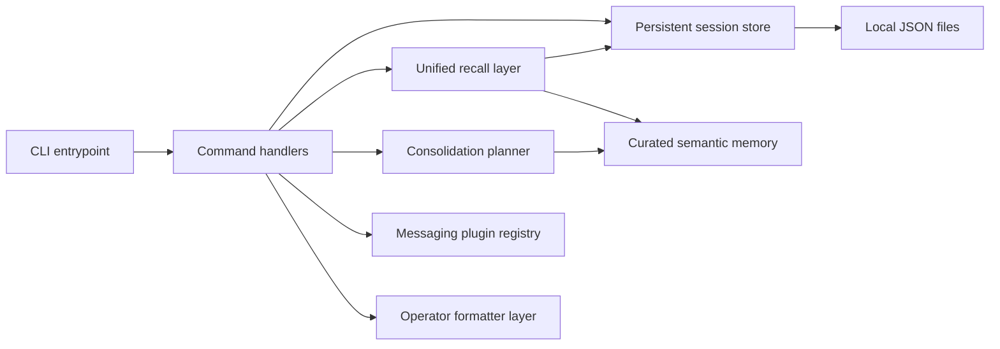
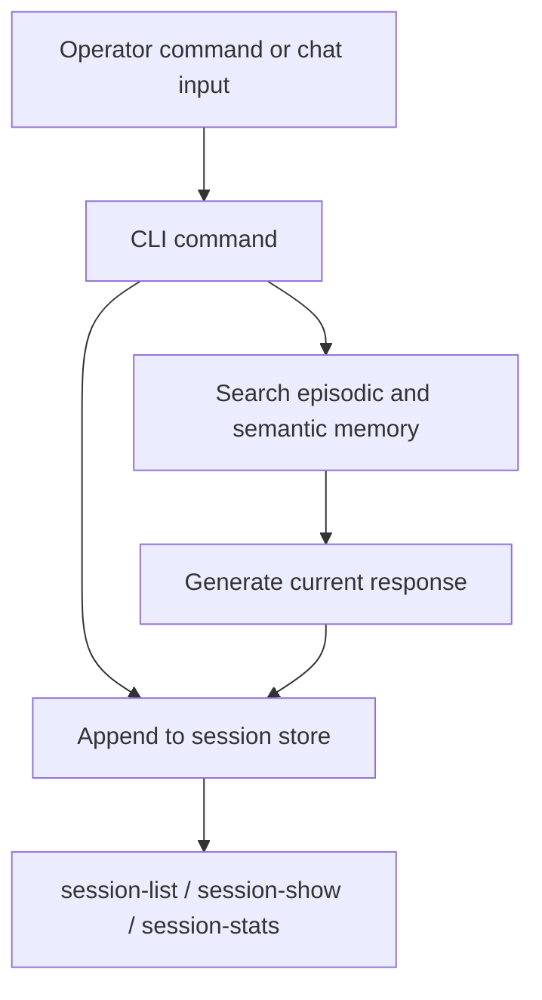

# RocketClaw2 Architecture

## Goal
RocketClaw2 is a Node.js and TypeScript reimplementation of RocketClaw, preserving the idea of a modular personal AI runtime while moving toward a local-first, plugin-oriented, operator-friendly architecture.

## Current stack
- **Language:** TypeScript on Node.js 22+
- **CLI:** `commander`
- **Config and validation:** local config loader with `zod`, `yaml`
- **HTTP client:** `undici`
- **Logging foundation:** `pino`
- **Testing:** `vitest`
- **Persistence:** local file-backed state for sessions and semantic memory

## Current implemented modules
- `src/cli.ts` - command registration and CLI entrypoint
- `src/commands/` - command-specific runtime behavior such as interactive chat
- `src/config/` - app paths and config loading
- `src/core/` - runtime summary and core runtime helpers
- `src/memory/` - search, recall, salience scoring, consolidation, semantic memory promotion
- `src/messaging/` - channel registry and plugin contract foundation
- `src/sessions/` - persistent session types, store, and aggregate stats
- `src/tui/` - human-readable formatter layer and TUI roadmap scaffolding

## Architecture overview

## Runtime flow

## Memory model
RocketClaw2 now has the first working layers of the planned tiered memory design:

- **Episodic memory:** persistent session history stored locally
- **Semantic memory:** curated durable facts promoted from consolidation candidates
- **Unified recall:** combined search over both episodic and semantic stores
- **Retrieval scoring:** the same lexical scoring model now applies to session memory and semantic memory, with phrase-first ranking and token-overlap fallback for out-of-order queries
- **Decay model:** episodic session memory now decays faster than curated semantic memory during recall ranking, which better matches the intended tiered memory design
- **Configurable scoring:** recall salience, dedupe preference, diversity penalty, and decay weights can now be tuned through persisted app config instead of only code changes
- **Dreaming precursor:** salience scoring plus a consolidation planner that identifies promotion candidates

## Messaging model
Messaging is being built around a channel registry and plugin contract so channel support can grow without rewiring the core runtime.

Current state:
- plugin registry exists
- CLI can list channels and invoke configured send flows
- WhatsApp remains the first target channel in the roadmap

## Operator UX direction
The richer TUI is still future work, but the project now has a formatter layer that improves terminal usability today:
- human-readable session list and detail views
- aggregate session stats
- human-readable semantic memory inspection
- JSON output for scripting or automation

## Near-term architecture priorities
1. improve retrieval quality and consolidation behavior
2. expand memory-aware runtime behavior beyond the current echo-style chat shell
3. deepen channel plugin implementation, starting with WhatsApp-oriented workflows
4. evolve formatter-backed operator flows into a smarter TUI

## Advanced design directions

### Memory optimization
RocketClaw2 should continue moving beyond naive retrieval into a psychology-grounded memory model.

Planned concepts:
- **episodic vs semantic split**
  - episodic = what happened recently in sessions
  - semantic = durable facts, architecture constraints, preferences, and long-lived project truths
- **memory decay**
  - low-value episodic details should lose salience over time unless reinforced
  - high-value semantic constraints can be pinned as durable memory
- **vector compaction and contextual retrieval**
  - future memory retrieval should support embeddings so only top-k relevant memory is injected into active context
- **dreaming-style consolidation**
  - summarize, cluster, promote, prune, and refresh retrieval indexes on a schedule

### Context window management
RocketClaw2 should support more than one context strategy:
- **massive-window mode** for cases where reading large repository state is beneficial
- **handoff/reset mode** for long tasks where command noise and diff churn degrade coherence
- **handoff artifacts** should become a first-class object for restarting work with compressed state

### Task decomposition and orchestration
RocketClaw2 should adopt a parent/child orchestration model:
- planning mode before implementation
- explicit task artifacts in markdown or JSON
- sub-agents with least-privilege context
- isolated briefs with only the files, docs, and expected outcomes they need

### Proactive validation and quality gates
RocketClaw2 should enforce closed-loop verification:
- linter and type checks
- unit tests and targeted validation
- critic/self-reflection loops when validation fails
- heartbeat-style background checks for long-running jobs, CI/CD, or monitored workflows

### Interface model
RocketClaw2 should embrace both:
- **terminal-first operation** for local developer workflows
- **message-based operation** for collaborative background assistance

### Execution model
RocketClaw2 should remain plugin-based and skill-oriented:
- channel plugins for messaging surfaces
- tool plugins for capability access
- MCP integration for standard external tool connectivity
- optional workflow automation connectors where useful
